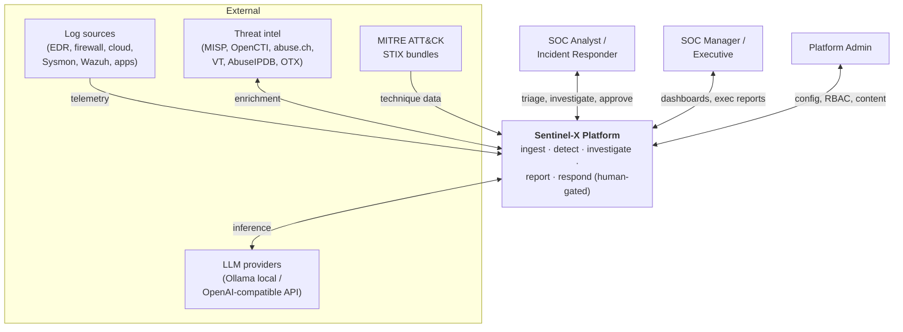
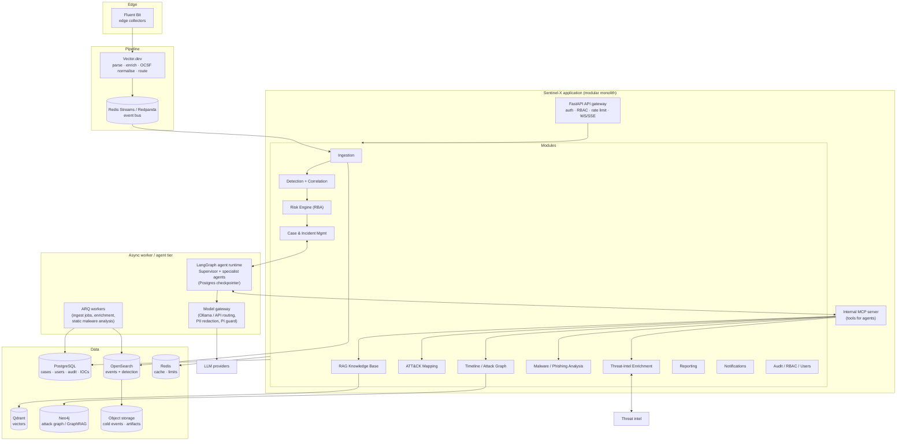
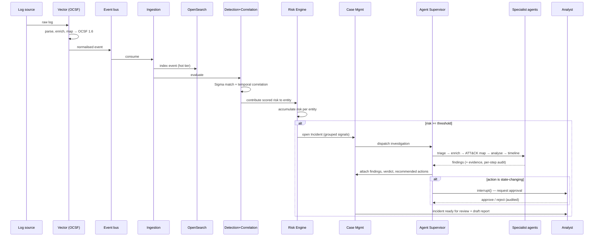

# 03 · System & Service Architecture

*Phase 1 · Sentinel-X · covers requested deliverables 6, 7*

---

## 1. Architecture style: modular monolith with extractable seams

Sentinel-X is a **modular monolith**: one deployable FastAPI application composed of strongly
bounded modules, running alongside a **separate async worker/agent tier** and standalone **stateful
backing services**. This is a deliberate, defended choice — not a compromise. See
[ADR-0002](adr/ADR-0002-modular-monolith-over-microservices.md) for the full argument; the summary:

- A solo/small-team portfolio platform that must *run on a laptop for demos and scale in a cluster*
  cannot afford the operational tax of 15+ microservices (service discovery, distributed tracing
  across every hop, network-partition failure modes, per-service CI/CD, schema-contract management).
- Clean Architecture + module boundaries give **90% of the benefit** (independent development,
  testability, clear ownership) at a fraction of the cost.
- The boundaries are drawn so any hot module (ingestion, detection, agent runtime) can be **lifted
  out into its own service later** without rewriting callers — communication already goes through
  interfaces and the event bus, not in-process function calls into another module's internals.

> **Interview framing:** "I chose a modular monolith and can articulate exactly which three services
> I would extract first, under what load, and what would break if I'd started distributed" is a
> stronger signal than a naive microservice mesh.

## 2. Logical layers (Clean Architecture)

Each module follows the same internal layering, dependencies pointing inward only:

```
┌───────────────────────────────────────────────────────────────┐
│  Interface / API layer   (FastAPI routers, WebSocket, MCP srv)  │  ← depends inward
├───────────────────────────────────────────────────────────────┤
│  Application layer       (use-cases / services, orchestration)  │
├───────────────────────────────────────────────────────────────┤
│  Domain layer            (entities, value objects, policies)    │  ← no framework imports
├───────────────────────────────────────────────────────────────┤
│  Infrastructure layer    (repositories, DB, HTTP clients, LLM)  │  ← implements domain ports
└───────────────────────────────────────────────────────────────┘
```

- **Domain** has zero framework/DB imports — pure Python, unit-testable in isolation.
- **Application** depends only on domain ports (Protocols/ABCs); it never imports SQLAlchemy or httpx
  directly. This is what makes a module extractable and what makes agents testable with fake tools.
- **Infrastructure** implements the ports (a `PostgresCaseRepository` implements `CaseRepository`).
- **Interface** is thin: validate, call an application use-case, serialise. No business logic.

Dependency direction is enforced in CI with `import-linter` contracts.

## 3. C4 Level 1 — System context



## 4. C4 Level 2 — Container / component view



## 5. Primary data flow: telemetry → incident → investigation → report



## 6. Communication patterns

| Interaction | Mechanism | Why |
|-------------|-----------|-----|
| Source → platform | Vector → event bus → consumer | Decouples ingest rate from processing; backpressure; multi-route (hot store + cold store). |
| Module → module (query) | In-process application-service call through a port interface | Cheap, transactional, testable. Boundaries are logical, enforced by import-linter. |
| Module → module (event) | Event bus topic (e.g. `incident.opened`) | For anything that fans out or must survive extraction to a separate service. |
| Agent → tools | **MCP** (internal server) | Uniform, auditable, injection-guarded tool surface. |
| Agent → LLM | Model gateway (OpenAI-compatible) | Provider-agnostic routing + guarding. |
| API → client | REST (OpenAPI) + WebSocket/SSE | Request/response + live alert/agent-step streaming. |
| Long-running work | ARQ jobs / LangGraph durable runs | Survive restarts; resumable; no HTTP timeouts. |

## 7. Microservice decomposition analysis (deliverable 7)

**Verdict: microservices are not appropriate for v1, and the design says so explicitly.** But the
seams are pre-drawn. If/when load or team size justifies extraction, this is the order and the
trigger:

| Rank | Extract | Trigger | Why first | Coupling to sever |
|------|---------|---------|-----------|-------------------|
| 1 | **Ingestion + Detection worker** | Sustained EPS outgrows one host's CPU, or ingest spikes starve the API | Most CPU-bound, most independently scalable, already bus-driven | None beyond the bus + OpenSearch client — cleanest seam |
| 2 | **Agent runtime** | Concurrent investigations saturate LLM/worker capacity; need GPU-node affinity | Different scaling axis (LLM I/O), different hardware (GPU), bursty | Talks to app only via bus events + MCP + Postgres checkpointer |
| 3 | **RAG / embeddings service** | Embedding/rerank load or model memory needs isolation | GPU-bound, model-heavy, cache-friendly | Stateless HTTP behind a port interface already |
| — | Everything else (cases, RBAC, reporting, TI) | Rarely justified | Transactional, share the Postgres system-of-record; splitting them creates distributed-transaction pain for little gain | keep in the monolith |

**What would break if we'd started microservices:** distributed transactions across
case/incident/audit writes; N× the observability wiring; contract-versioning overhead between
services that change together; and a demo that no longer runs on a laptop. The modular monolith
avoids all four while keeping the option open.

## 8. Cross-cutting concerns (uniform across modules)

- **AuthN/AuthZ**: JWT at the gateway, RBAC policy checks in the application layer (see [§07](07-security-architecture.md)).
- **Audit**: every state change and every agent decision writes a tamper-evident audit record (hash-chained).
- **Observability**: OpenTelemetry context propagated from API → worker → agent step → tool call, so a single incident investigation is one distributed trace.
- **Multi-tenancy seam**: an `org_id` is threaded through the data model and Qdrant/OpenSearch filters from day one, even though v1 targets a single organisation — extraction to true multi-tenant SaaS later doesn't require a data migration.
- **Config**: 12-factor; Pydantic `Settings` from env/secret store; no secrets in code (gitleaks in CI).

## 9. Scalability posture

- **Stateless app & worker tiers** scale horizontally behind the gateway / off the bus.
- **OpenSearch** scales by sharding + hot/warm/cold tiers with searchable snapshots to object storage.
- **PostgreSQL** scales read replicas + PgBouncer; partition the audit and events-metadata tables by time.
- **Bus** upgrades Redis Streams → Redpanda without code changes to producers/consumers (same abstraction).
- **Agents** scale by worker count; LLM throughput is the real limit, mitigated by local Ollama + caching + routing cheap extraction to small models.
