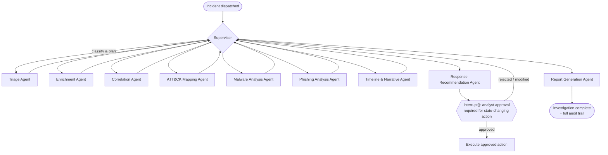
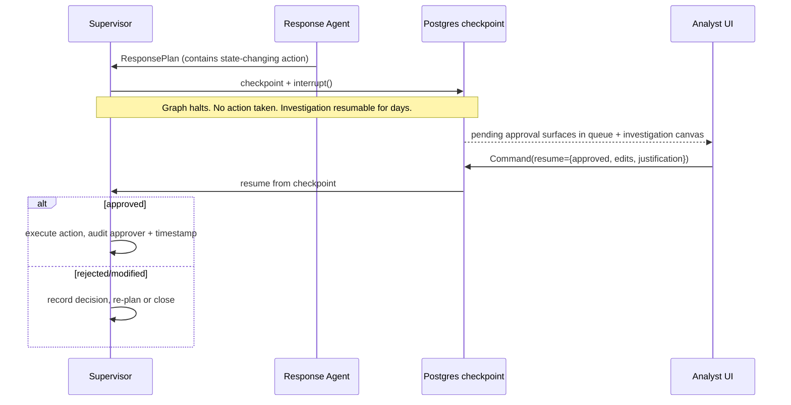

# 04 · AI Agent Architecture

*Phase 1 · Sentinel-X · covers requested deliverable 12*

The agentic investigation subsystem is the platform's headline capability and its highest-risk
surface. This document specifies how it works and — equally important — the guardrails that keep it
trustworthy.

---

## 1. Design principles

1. **Determinism first, agency where it pays.** Detection is deterministic (Sigma + correlation).
   The LLM is used for enrichment reasoning, correlation narrative, triage ranking, summarisation,
   and report drafting — *not* for deciding what is malicious in the first instance.
2. **Fixed edges over agentic routing.** Where the workflow is known (and SOC investigation largely
   is), the graph uses explicit edges, not an LLM deciding the next step. This is cheaper, testable,
   and removes a prompt-injection surface. The supervisor's LLM routing is reserved for genuinely
   open-ended branches.
3. **Human-in-the-loop on every consequential action.** Enrichment/analysis run freely; anything
   state-changing (containment, ticket closure, blocklist push, notification to external parties)
   halts at an `interrupt()` gate for analyst approval.
4. **Everything is audited.** Each node entry/exit, tool call, tool result, model prompt/response
   hash, and decision is persisted as an immutable, reviewable trail — the compliance whitespace
   §01 identified.
5. **All tool output is untrusted.** MCP tool results, enrichment API responses, and file contents
   are treated as potential prompt-injection vectors and are sandboxed/escaped before entering a
   prompt.

## 2. Orchestration: LangGraph supervisor pattern



**Why supervisor, not swarm or hierarchical** (see [ADR-0006](adr/ADR-0006-langgraph-supervisor-agents.md)):

- **Supervisor** gives central control and a single auditable decision point — essential when a
  regulator or manager must review *why* the system reached a verdict. Chosen default.
- **Swarm** (peer-to-peer handoff) is better for fluid conversation, worse for auditable pipelines —
  rejected.
- **Hierarchical** (supervisors of supervisors) is only justified past ~10–15 workers; we have ~9
  specialists, so a flat supervisor suffices. Revisit if the agent roster grows.

## 3. The specialist agents

| Agent | Job | Key tools (via MCP) | Model tier | Output (typed) |
|-------|-----|---------------------|------------|----------------|
| **Triage** | Classify severity, dedupe, decide investigation depth, filter obvious FPs | risk-context lookup, similar-incident search (Qdrant), asset criticality | small (Qwen3) | `TriageVerdict{severity, is_fp, confidence, plan}` |
| **Enrichment** | Resolve IOCs (IP/domain/hash/URL) against intel | MISP, OpenCTI, abuse.ch, VT, AbuseIPDB, OTX (cache-first) | small | `EnrichmentResult[]{ioc, reputation, sources, first_seen}` |
| **Correlation** | Find related events/entities across the incident window | OpenSearch query, entity-graph query (Neo4j) | mid | `CorrelationGraph{entities, edges, related_events}` |
| **ATT&CK Mapping** | Map observed behaviour to techniques/tactics | ATT&CK v18 lookup, technique RAG | mid | `AttackMapping[]{technique_id, tactic, evidence, confidence}` |
| **Malware Analysis** | Static triage of attached/observed files | YARA-X, PE/LIEF, oletools, hash lookup, optional sandbox connector | small + tools | `MalwareVerdict{family, iocs, capabilities, severity}` |
| **Phishing Analysis** | Analyse suspicious emails/URLs | email auth (SPF/DKIM/DMARC), URL analysis, dnstwist, brand-impersonation checks | small + tools | `PhishingVerdict{is_phish, techniques, iocs, targets}` |
| **Timeline & Narrative** | Reconstruct ordered attack timeline + human-readable story | correlation output, event fetch | mid | `Timeline{steps[], narrative}` |
| **Response Recommendation** | Propose remediation, mapped to severity & playbooks | playbook RAG, asset context | mid | `ResponsePlan{actions[], each: rationale, reversibility, requires_approval}` |
| **Report Generation** | Draft technical + executive reports | RAG over findings, template store | mid | `Report{technical_md, executive_md, iocs, attack_layer}` |

Agents are implemented as LangGraph nodes with **typed Pydantic state**; several (Triage,
Enrichment, Malware, Phishing) are effectively structured-extraction agents where **Pydantic-AI or
Ollama `format=schema`** guarantees valid JSON rather than prompt-begging.

## 4. Shared state & durability

```python
# Conceptual shape — the investigation state object threaded through the graph
class InvestigationState(TypedDict):
    incident_id: str
    org_id: str
    entities: Annotated[list[Entity], merge_entities]     # reducer-merged across agents
    observables: Annotated[list[Observable], add]
    enrichments: Annotated[list[EnrichmentResult], add]
    attack_mappings: Annotated[list[AttackMapping], add]
    findings: Annotated[list[Finding], add]
    timeline: Timeline | None
    response_plan: ResponsePlan | None
    verdict: IncidentVerdict | None
    audit: Annotated[list[AgentStep], add]                # append-only decision trail
    pending_approval: ApprovalRequest | None              # set when interrupt() fires
```

- **Checkpointer:** `AsyncPostgresSaver` — every super-step is persisted, keyed by
  `thread_id = incident_id`. A crash, restart, or a day-long wait for analyst approval all resume
  from the last checkpoint with zero lost work.
- **Reducers** (`add_messages`-style) merge concurrent agent contributions deterministically.
- **Subgraphs:** malware and phishing analysis are compiled subgraphs added as nodes, so they're
  independently testable and reusable outside an incident (e.g. an analyst manually submits a file).

## 5. Human-in-the-loop gates



Approval requests carry **action, rationale, reversibility, blast radius, and the evidence** the
recommendation rests on — so the analyst approves with context, not blind. Every decision records
*who* approved, *when*, and *what they changed*.

## 6. Model gateway

A single abstraction (see [ADR-0007](adr/ADR-0007-model-gateway.md)) sits between agents and models:

- **Routing:** structured extraction & summarisation → local **Ollama Qwen3** (temp 0,
  `format=schema`, explicit `num_ctx`); heavy multi-step reasoning → configurable
  OpenAI-compatible endpoint. Routing policy is config-driven, per-agent.
- **Cost & rate control:** token accounting, per-org budgets, caching of identical
  enrichment/summarisation calls.
- **Guarding (input):** PII redaction middleware; injection-pattern screening on any content that
  originated outside the platform before it enters a prompt.
- **Guarding (output):** structured-output validation; the model's *proposed* actions are data, not
  commands — they only take effect through the deterministic execution path behind a human gate.
- **Fallback:** provider outage → fallback model; degraded mode explicitly surfaced in the audit
  trail rather than silently substituting.

## 7. Tool layer (MCP)

- Internal capabilities (case lookup, IOC enrichment, Sigma/rule search, OpenSearch query,
  ATT&CK lookup, static malware analysis, Neo4j entity query, RAG search) are exposed through an
  **internal MCP server** (FastMCP). One uniform, versioned, auditable tool surface.
- External intel is consumed via **official MCP servers** where they exist (OpenCTI `xtm-mcp`, MISP
  `misp-mcp`) and via SDK-backed MCP wrappers otherwise (VT, AbuseIPDB, OTX).
- **Tool-result trust boundary:** every MCP result is tagged with provenance and treated as
  untrusted input. Tool *descriptions* (a known injection vector) are curated and static, never
  model-generated.

## 8. RAG inside the agent loop

- **Knowledge RAG (Qdrant hybrid, BGE-M3):** runbooks/playbooks, past incident write-ups, threat
  reports, internal policy. Used by Triage (similar-incident recall), Response (playbook retrieval),
  and Report (precedent). See [ADR-0009](adr/ADR-0009-rag-vs-graphrag.md).
- **GraphRAG (Neo4j):** reserved for multi-hop threat-intel questions ("which actors use this
  technique against our sector, and what else do they deploy?") where STIX's native graph structure
  and attack-path traversal genuinely beat vector recall.

## 9. Evaluation & safety

Because Gartner's own caution is *"vendor claims outpace evidence,"* the platform bakes in
measurement:

- **Golden-set evaluation:** a labelled corpus of incidents with known verdicts; every agent/prompt
  change is scored for triage accuracy, FP-suppression, and enrichment precision before merge (a
  CI gate).
- **Groundedness checks:** findings must cite the evidence (event IDs, IOC sources) they rest on;
  unsupported claims are flagged.
- **Regression guard:** prompt and model-version changes run against the golden set; a metrics
  regression blocks the PR.
- **Kill switch & degraded mode:** agents can be globally paused; when models are unavailable the
  platform falls back to deterministic detection + manual triage, never to guessing.

## 10. Why this beats the incumbent AI layers on the dimensions that matter

| Dimension | Incumbent norm | Sentinel-X |
|-----------|----------------|------------|
| Auditability | Often a black box | Per-step, evidence-linked, immutable trail |
| Autonomy safety | "Autonomous action" marketing | Mandatory human gates on state-changing actions |
| Pricing/lock-in | SCU/credit metering | Local-first, provider-agnostic gateway |
| Injection defence | Uneven | Untrusted-by-default tool output, curated tool descriptions, output-as-data |
| Testability | Opaque | Typed state, subgraphs, golden-set CI evaluation |
