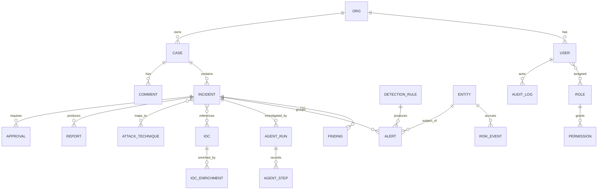

# 05 · Database Design

*Phase 1 · Sentinel-X · covers requested deliverable 8*

---

## 1. Polyglot persistence — the assignment of workloads to stores

One store cannot serve OLTP integrity, full-text/aggregation search over billions of events, vector
similarity, and multi-hop graph traversal well. Each store below owns the workload it is best at
(rationale in [ADR-0004](adr/ADR-0004-polyglot-persistence.md)); a **`lite` profile** collapses the
footprint for laptops/demos (§7).

| Store | Owns | Workload shape |
|-------|------|----------------|
| **PostgreSQL 16** | System of record: users, roles, orgs, cases, incidents, findings, IOC catalogue, detection-rule metadata, agent-run records, **audit log** | OLTP, relational integrity, moderate volume, strong consistency |
| **OpenSearch 2.x** | Security events (OCSF), detection results, hunting | Append-heavy, time-series, full-text + aggregations, huge volume |
| **Qdrant** | Embeddings for RAG + alert/incident similarity | ANN vector search + payload filters |
| **Neo4j** | Attack graph, entity relationships, STIX threat-intel graph | Multi-hop traversal, path finding |
| **Redis 7** | Cache, rate-limit counters, ephemeral state, Redis Streams bus | Low-latency KV, TTL, streams |
| **Object storage (S3/MinIO)** | Cold events (searchable snapshots), uploaded artifacts, generated reports | Cheap durable blobs |

---

## 2. PostgreSQL — relational core

### 2.1 Entity-relationship overview

### 2.2 Key tables (abbreviated columns; all use UUID v7 PKs, `org_id` tenant key, `created_at/updated_at`)

- **`orgs`** — tenant boundary (single org in v1, seam for multi-tenant later).
- **`users`** — `email`, `hashed_password` (argon2id), `is_active`, `mfa_secret`, `last_login`.
- **`roles`**, **`permissions`**, **`user_roles`**, **`role_permissions`** — RBAC (see [§07](07-security-architecture.md)); permissions are `resource:action` strings.
- **`entities`** — normalised actors/assets (user, host, ip, service) with `risk_score` (materialised from `risk_events`), `criticality`, `first_seen`, `last_seen`. The RBA subject.
- **`risk_events`** — append-only: `entity_id`, `rule_id`, `score`, `reason`, `event_ref`, `ts`, `decay_at`. The heart of Risk-Based Alerting; incidents open when summed non-decayed risk crosses a threshold.
- **`detection_rules`** — Sigma rule metadata: `sigma_id`, `title`, `level`, `status` (draft/test/prod), `logsource`, `attack_techniques[]`, `version`, `enabled`, `false_positive_notes`. Rule *bodies* live in the content repo; this table tracks lifecycle and stats.
- **`alerts`** — a single detection hit: `rule_id`, `entity_id`, `event_ref` (OpenSearch doc id), `severity`, `risk_contributed`, `status`, `incident_id?`.
- **`cases`** — analyst work container: `title`, `status`, `assignee_id`, `priority`, `tags[]`, `sla_due`.
- **`incidents`** — grouped, risk-triggered: `case_id?`, `title`, `severity`, `status` (new/investigating/contained/resolved/false_positive), `risk_score`, `verdict`, `opened_at`, `closed_at`, `mttr`.
- **`findings`** — investigation outputs: `incident_id`, `type`, `summary`, `confidence`, `evidence` (JSONB, event refs/IOC ids), `produced_by` (agent name/version).
- **`iocs`** — deduped observable catalogue: `type` (ip/domain/url/hash/email), `value` (indexed, unique per org), `tlp`, `first_seen`, `last_seen`, `confidence`.
- **`ioc_enrichments`** — `ioc_id`, `source`, `verdict`, `raw` (JSONB), `fetched_at`, `expires_at` (cache TTL — critical for VT 500/day economics).
- **`attack_techniques`** — cached ATT&CK v18 catalogue (`technique_id`, `tactic`, `name`, `platforms`, `detection_strategies`); `incident_techniques` join carries `evidence`, `confidence`.
- **`agent_runs`** — one per investigation: `incident_id`, `graph_version`, `status`, `model_route`, `token_cost`, `started_at`, `finished_at`. Correlates with the LangGraph checkpoint (`thread_id = incident_id`).
- **`agent_steps`** — immutable per-node record: `run_id`, `agent`, `input_hash`, `output_hash`, `tool_calls` (JSONB), `duration_ms`, `ts`. The reviewable decision trail.
- **`approvals`** — HITL gate: `incident_id`, `action`, `rationale`, `reversibility`, `requested_at`, `decided_by?`, `decision`, `decided_at`, `justification`.
- **`reports`** — `incident_id`, `type` (technical/executive), `format`, `storage_key`, `generated_by`, `version`.
- **`audit_log`** — tamper-evident (§4).
- **`comments`**, **`attachments`**, **`notifications`**, **`saved_searches`**, **`playbooks`**.

### 2.3 Modelling decisions

- **UUID v7** primary keys — globally unique (multi-store correlation, future service extraction) and time-sortable (index locality), unlike v4.
- **JSONB for evidence/raw/tool_calls** — schema-flexible payloads that don't warrant columns, still queryable with GIN indexes.
- **Append-only `risk_events` and `agent_steps`** — never updated; enables audit and time-decay without destructive writes.
- **Time-partitioning** on `risk_events`, `alerts`, `agent_steps`, `audit_log` (monthly, `pg_partman`) — bounds index size and makes retention/archival a partition drop.
- **Materialised `entities.risk_score`** — recomputed on risk-event insert via trigger/worker, so "who is risky now" is a single indexed read, not an aggregate scan.
- **`org_id` on every business table** with composite indexes `(org_id, ...)` — the multi-tenant seam and the natural query prefix.

---

## 3. OpenSearch — event & detection store

### 3.1 Index strategy

- **Data streams** per source category, OCSF-shaped: `events-ocsf-<category>-<yyyy.MM.dd>` (e.g.
  `events-ocsf-network-2026.07.22`) with ISM (Index State Management) rolling hot → warm → cold →
  searchable-snapshot (object storage) → delete, per retention policy.
- **Explicit mappings** derived from the OCSF classes in use — store `class_uid`, `activity_id`,
  `severity_id`, `time`, entity fields (`src`, `dst`, `principal`, `device`), plus a trimmed
  attribute set; **not** the full OCSF surface (it's verbose — index what detection/hunt needs,
  keep the raw event as a `keyword`/`binary` field or in object storage).
- **Index templates + component templates** so all OCSF classes share common field definitions
  (`observables`, `metadata`, `enrichments`).

### 3.2 Detection & search usage

- **Sigma → pySigma → OpenSearch queries** run as scheduled monitors and on-ingest evaluation.
- **OpenSearch Security Analytics** detectors provide 2,200+ prepackaged Sigma detections.
- **Random Cut Forest** anomaly detectors for scoped signals (beaconing intervals, volumetric spikes).
- **Retrohunting**: IOC sweeps across the warm/cold tiers when new intel arrives.

### 3.3 Why OpenSearch, not Elasticsearch

Apache-2.0 licensing (no SSPL/AGPL trap), and Security Analytics + RCF anomaly detection ship
built-in. Full argument in [ADR-0011](adr/ADR-0011-opensearch-over-elasticsearch.md).

---

## 4. Tamper-evident audit log

Audit is a security-product requirement, not a nice-to-have. Design:

- Append-only `audit_log(id, org_id, actor_id, action, resource_type, resource_id, before, after, ts, prev_hash, entry_hash)`.
- **Hash chain**: `entry_hash = SHA-256(prev_hash || canonical(entry))`. Any tampering breaks the
  chain and is detectable by a verifier job. Periodic checkpoints (the latest `entry_hash`) can be
  externally witnessed (e.g. written to object storage with versioning + object lock) for stronger
  guarantees.
- Written in the **same DB transaction** as the change it records (no lost audit on crash).
- Covers: auth events, RBAC changes, rule enable/disable, incident state changes, **every agent
  decision and approval**, config changes, data exports.

---

## 5. Qdrant — vector collections

| Collection | Vectors | Payload filters | Purpose |
|------------|---------|-----------------|---------|
| `kb_chunks` | BGE-M3 dense + sparse (hybrid) | `org_id`, `doc_type`, `source`, `tlp` | Runbooks, threat reports, policy — RAG |
| `incident_embeddings` | dense | `org_id`, `severity`, `verdict`, `ts` | Similar-incident recall for triage |
| `ioc_context` | dense | `org_id`, `ioc_type` | Semantic IOC/report linking |

- **Hybrid search** (RRF/DBSF fusion) on `kb_chunks` — BGE-M3 emits both vectors from one model.
- **Filterable HNSW** so `org_id`/time/TLP filters apply *during* traversal (correctness + speed).
- **int8 quantization** for RAM economy at scale.

---

## 6. Neo4j — attack & intel graph

- **Node labels**: `Entity` (Host/User/IP/Domain/File), `Incident`, `Technique`, `ThreatActor`,
  `Malware`, `Campaign`, `Indicator`.
- **Relationships**: `(:Entity)-[:CONNECTED_TO]->(:Entity)`, `(:Incident)-[:INVOLVES]->(:Entity)`,
  `(:Entity)-[:EXHIBITS]->(:Technique)`, `(:ThreatActor)-[:USES]->(:Technique|:Malware)`,
  `(:Indicator)-[:INDICATES]->(:ThreatActor)`.
- **STIX 2.1 ingest** from MISP/OpenCTI maps SDO/SRO directly onto this graph (STIX *is* a graph).
- **Uses**: attack-path reconstruction, blast-radius ("what else did this host touch"), and GraphRAG
  multi-hop intel questions. Native vector index available for hybrid graph+vector if needed.

---

## 7. Deployment profiles

| Profile | Stores running | Target |
|---------|----------------|--------|
| **`lite`** | PostgreSQL, OpenSearch (single node), Redis, Qdrant | Laptop demo / single analyst. Neo4j optional (graph features degrade gracefully to Postgres recursive CTEs); object storage → local volume. |
| **`dev`** | All stores, single-node each | Full feature development |
| **`prod`** | PG (primary+replica, PgBouncer), OpenSearch cluster (hot/warm/cold), Qdrant (replicated), Neo4j, Redis (+Redpanda bus), MinIO/S3 | Cluster deployment |

Feature-flags detect absent optional stores and degrade gracefully (e.g. no Neo4j → attack graph
falls back to Postgres adjacency queries with a UI notice), so the platform always runs.

---

## 8. Data lifecycle & retention

| Data | Hot | Warm/Cold | Retention |
|------|-----|-----------|-----------|
| Events (OpenSearch) | 30 d | searchable snapshot → object storage | 1 yr default (configurable; compliance-driven) |
| Risk events (PG) | current | partition archive | 90 d active, then summarised |
| Incidents/cases/findings | indefinite | — | per policy; legal-hold flag prevents deletion |
| Audit log | indefinite | partition → object storage w/ object-lock | ≥ 1 yr, immutable |
| IOC enrichments | TTL-cached | — | source-dependent (VT/abuse.ch expiry honoured) |
| Agent checkpoints | until incident closed + grace | — | pruned after retention window |

Deletion is always soft-first (`deleted_at`) with a separate, audited hard-delete job — consistent
with the platform's "never silently destroy data" posture.
