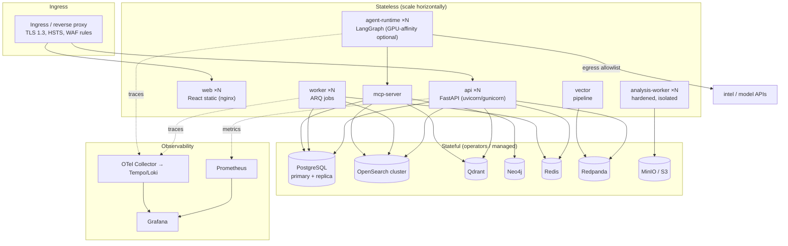

# 08 · Deployment & CI/CD

*Reference design, July 2026.*

> **Status — partially current.** **Built:** the Compose `lite` profile (§A.4, now with OpenSearch and the
> worker), hardened images (§A.5), and the GitHub Actions pipeline. **Not built:** Kubernetes/Helm and the
> `full` profile. **Not adopted** ([ADR-0014](adr/ADR-0014-lock-scope-security-investigation.md)): Qdrant,
> Neo4j, Redpanda, MinIO and agent-runtime services. The Compose stack and images were run end to end
> on the development machine in Phase 7 ([runbook](runbook.md)); Kubernetes and the CI workflow were not.

---

## Part A — Deployment Architecture

### A.1 Two profiles, one codebase

The same images run in both profiles; only the orchestration and replica counts differ.

| Profile | Orchestrator | Purpose | Footprint |
|---------|--------------|---------|-----------|
| **`lite` / `dev`** | Docker Compose | Laptop demo, single-analyst eval, local development | Single-node each service; optional stores degrade gracefully |
| **`prod`** | Kubernetes + Helm | Cluster deployment, HA, horizontal scale | Multi-replica app/workers, clustered stores |

### A.2 Container topology

### A.3 Kubernetes design (`prod`)

- **Namespaces**: `sentinelx-app`, `sentinelx-data`, `sentinelx-observability`.
- **Workloads**: `Deployment`s for stateless tiers (HPA on CPU + custom metrics: bus lag, queue
  depth); `StatefulSet`s or operators for stores (Zalando Postgres operator, OpenSearch operator,
  Qdrant, Neo4j, Redpanda).
- **Config/secrets**: `ConfigMap` for non-secret config; `Secret` + sealed-secrets/Vault for
  credentials and JWT signing keys.
- **Networking**: `NetworkPolicy` default-deny; data namespace has no ingress from the internet;
  agent/analysis egress restricted to an allowlist.
- **Resilience**: liveness/readiness/startup probes (`/healthz`, `/readyz`), `PodDisruptionBudget`s,
  anti-affinity across nodes, resource requests/limits, graceful shutdown (LangGraph checkpoints +
  ARQ drain).
- **Storage**: `PersistentVolumeClaim`s with a fast class for hot OpenSearch/PG; object storage for
  cold tiers/artifacts/reports.
- **Autoscaling axes** (per [§03](03-system-architecture.md) §9): API on request load, workers on
  queue depth, agent-runtime on concurrent-investigation count + LLM throughput.
- **Packaging**: a Helm umbrella chart with subchart values; Kustomize overlays for env
  (`dev`/`staging`/`prod`) differences.

### A.4 Docker Compose design (`lite`/`dev`)

- Compose **profiles** toggle optional services (`--profile full` adds Neo4j, Redpanda, MinIO,
  observability; `lite` omits them and the app degrades gracefully).
- Named volumes for persistence; healthchecks with `depends_on: condition: service_healthy`;
  a one-shot `migrate` service runs Alembic + seeds before the API starts.
- A `.env.example` documents every variable; `make up` / `make seed` / `make demo` bootstrap a
  working instance with sample telemetry and detections.

### A.5 Images & build

- **Multi-stage** builds; slim/distroless runtime bases; non-root user; read-only root FS where
  possible; pinned base digests.
- Separate images: `api`, `worker`, `agent-runtime`, `analysis-worker`, `mcp-server`, `web`.
  (Same Python base layer, cached.)
- SBOM generated per image (syft); images scanned (trivy) and signed (cosign) in CI.

### A.6 Environments & release flow

`local → CI ephemeral → staging → prod`, promotion by image digest (immutable), config per env via
overlays. Blue/green or rolling deploys with automated readiness gating and one-command rollback
(previous digest). DB migrations are backward-compatible (expand/contract) so app and schema can
roll independently.

---

## Part B — CI/CD Design (GitHub Actions)

### B.1 Pipeline overview

```mermaid
graph LR
    PR["Pull request"] --> LINT
    subgraph CI
      LINT["Lint & format<br/>ruff, ruff-format,<br/>eslint, prettier"]
      TYPE["Type check<br/>mypy, tsc"]
      TEST["Tests<br/>pytest+cov, vitest"]
      ARCH["Arch rules<br/>import-linter"]
      SEC["Security<br/>bandit, semgrep,<br/>gitleaks, pip-audit"]
      EVAL["Agent eval<br/>golden-set gate"]
    end
    LINT --> TYPE --> TEST --> ARCH --> SEC --> EVAL
    EVAL --> BUILD
    subgraph CD
      BUILD["Build images<br/>multi-stage, cache"]
      SCAN["Scan + SBOM<br/>trivy, syft"]
      SIGN["Sign<br/>cosign"]
      PUSH["Push to registry<br/>(by digest)"]
      DEPLOY["Deploy<br/>Helm → staging → prod"]
    end
    BUILD --> SCAN --> SIGN --> PUSH --> DEPLOY
```

### B.2 Jobs & gates

| Stage | Tools | Gate |
|-------|-------|------|
| Format/lint | `ruff`, `ruff format`, `eslint`, `prettier` | Fail on any violation |
| Types | `mypy --strict` (backend), `tsc --noEmit` (frontend) | Fail on error |
| Unit/integration | `pytest` + `pytest-cov` (Testcontainers for PG/OpenSearch/Redis/Qdrant), `vitest` | Coverage threshold; all pass |
| Architecture | `import-linter` contracts | Fail if a module violates layer/boundary rules |
| SAST/secrets | `bandit`, `semgrep`, `gitleaks`, `pip-audit`, `npm audit` | Fail on high severity / any secret |
| API contract | OpenAPI diff | Fail on breaking change without version bump |
| **Agent eval** | golden-set scorer | Fail on triage-accuracy / FP-suppression regression |
| Image scan | `trivy` (image + config), `syft` SBOM | Fail on fixable high/critical CVEs |
| Sign/publish | `cosign`, registry push by digest | main branch only |
| Deploy | Helm, environment protection rules | Staging auto; prod requires approval |

### B.3 Testing strategy (what "tests" means per phase)

- **Unit** — domain logic, risk scoring, Sigma-mapping, OCSF normalisation, RBAC policies (pure,
  fast, no I/O).
- **Integration** — repositories against **Testcontainers** (real PG/OpenSearch/Redis/Qdrant), Vector
  pipeline transforms, MCP tool round-trips.
- **Contract** — OpenAPI ↔ generated TS client; MCP tool schemas.
- **Agent evaluation** — labelled golden incidents scored for accuracy/groundedness; treated as a
  first-class test suite, not an afterthought.
- **E2E** — a Compose-up smoke test that ingests sample telemetry, triggers a detection, opens an
  incident, runs an investigation to an approval gate, and asserts the audit trail — run on a
  schedule and pre-release.
- **Security** — the SAST/secret/dependency/image scans above, plus periodic DAST against staging.

### B.4 Supply-chain & release integrity

- Reproducible, pinned dependencies (`uv`/lockfiles, npm lockfile); Dependabot for updates.
- SBOM per release; signed images; provenance attestation (SLSA-oriented).
- Branch protection: required checks, review, signed commits; no direct pushes to `main`.
- Semantic versioning + generated changelog; release tags map to signed image digests.

### B.5 Operational feedback loop

Deployed services emit OpenTelemetry traces/metrics/logs to Grafana; SLO dashboards
(ingest lag, detection latency, MTTR, agent success rate, LLM cost/incident) and Prometheus
alerting close the loop so regressions in production are visible and tied back to releases.
