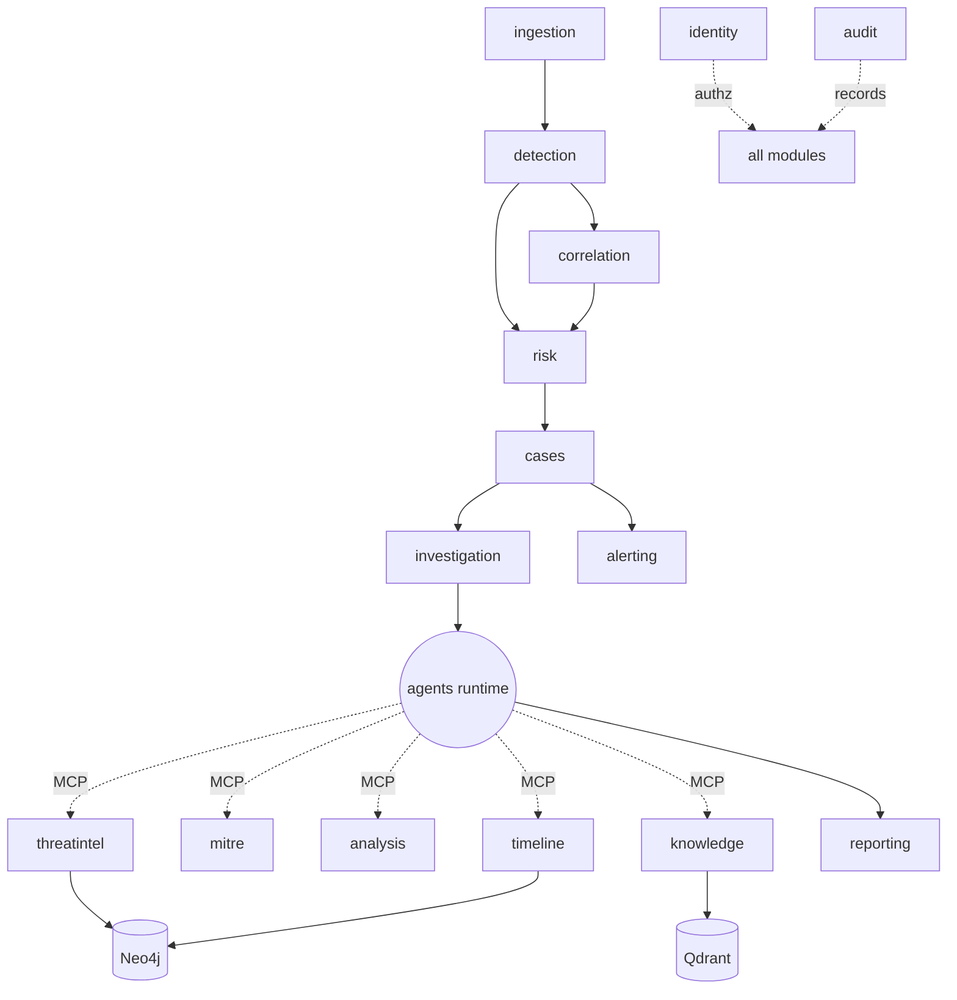

# 10 · Module Breakdown

*Phase 1 · Sentinel-X · covers requested deliverable 16*

Each module is a bounded context with the standard four-layer internal shape
([§09](09-folder-structure.md)). This document defines each module's responsibility, key
capabilities, data ownership, dependencies, external integrations, and how it improves on the
original brief's module list.

Legend for **Depends on**: `→` in-process port call; `⇢` event-bus/async; `⚙` MCP tool.

---

## Infrastructure / cross-cutting modules

### `identity` — Authentication, Users, RBAC
- **Responsibility**: authn (JWT + MFA), user/role/permission management, session lifecycle, tenant (`org`) boundary.
- **Owns**: `users`, `roles`, `permissions`, `orgs`, refresh-token store (Redis).
- **Depends on**: `core/security`, `core/audit`.
- **Notes**: PyJWT + argon2; RS256 access tokens, rotating refresh with reuse detection; optional OIDC. See [§07](07-security-architecture.md).

### `platform` — Health, Config, Audit-read, Metrics
- **Responsibility**: liveness/readiness, platform config (audited), read-only audit API, Prometheus metrics.
- **Owns**: `config`, exposes `audit_log` (read).

---

## Data-plane modules

### `ingestion` — Log Collection & OCSF Normalisation *(elevated from brief)*
- **Responsibility**: register sources, consume the bus, validate/normalise to **OCSF 1.6**, index to OpenSearch, emit events to detection.
- **Owns**: `ingest_sources`, OCSF mappers (shared with Vector VRL).
- **Depends on**: `core/events` ⇢, OpenSearch. Emits `event.ingested` ⇢ `detection`.
- **Improvement**: OCSF normalisation and the Vector pipeline are first-class, not an afterthought — *data quality is the binding constraint* per all research.

### `detection` — Detection-as-Code *(elevated)*
- **Responsibility**: manage Sigma rule lifecycle (draft→test→prod), compile via **pySigma** to OpenSearch, evaluate events, produce alerts; run OpenSearch Security Analytics + RCF anomaly detectors.
- **Owns**: `detection_rules` metadata; rule bodies in `detections/`.
- **Depends on**: OpenSearch, `mitre` → (technique tags). Emits `alert.raised` ⇢ `risk`.
- **Improvement**: detection-as-code with a promotion workflow + readable, MITRE-mapped rules — the transparency the market rewards (Elastic/Sigma lineage).

### `correlation` — Temporal / Multi-event Correlation *(new)*
- **Responsibility**: evaluate temporal and multi-event correlation logic (brute-force, beaconing chains, kill-chain sequences) over normalised events, because Sigma-correlation backend support is patchy.
- **Depends on**: OpenSearch, `detection`. Emits enriched correlated signals ⇢ `risk`.
- **Improvement**: correlation lives in an owned engine — a deliberate architectural decision, not a limitation.

### `risk` — Risk-Based Alerting Engine *(new, replaces per-alert notifications as primary)*
- **Responsibility**: attribute scored risk to entities from alerts/correlations, decay it over time, open **incidents** when accumulated risk crosses a threshold. The structural answer to alert fatigue.
- **Owns**: `entities`, `risk_events`, thresholds.
- **Depends on**: `detection`/`correlation` ⇢. Emits `incident.opened` ⇢ `cases`/`investigation`.
- **Improvement**: the single biggest divergence from the brief — moves the platform from "notify per alert" to "alert on accumulated risk" (Splunk RBA lineage).

---

## Investigation & intelligence modules

### `cases` — Case & Incident Management
- **Responsibility**: cases, incidents, findings, comments, approvals, SLA/status/assignment, MTTR tracking.
- **Owns**: `cases`, `incidents`, `findings`, `comments`, `approvals`, `alerts` linkage.
- **Depends on**: `risk` ⇢, `investigation` →. Emits `incident.updated` ⇢ `alerting`.

### `investigation` — Agentic Investigation glue
- **Responsibility**: dispatch LangGraph runs, surface live agent steps (WS), manage HITL approval gates, expose the immutable decision trail.
- **Owns**: `agent_runs`, `agent_steps` (read/orchestration; agents write via runtime).
- **Depends on**: `agents/` runtime ⇢, `cases` →. Consolidates the brief's "AI Investigation Engine" + "Multi-Agent AI" into one coherent subsystem.

### `threatintel` — Threat Intelligence & Enrichment
- **Responsibility**: STIX/TAXII, MISP, OpenCTI ingest; abuse.ch/VT/AbuseIPDB/OTX enrichers (cache-first, escalate-only); IOC catalogue; STIX→Neo4j graph load.
- **Owns**: `iocs`, `ioc_enrichments`, feed state.
- **Depends on**: Neo4j, external intel (egress-allowlisted), `core/audit`. Exposes `enrich` ⚙ to agents.

### `mitre` — MITRE ATT&CK Mapping
- **Responsibility**: ingest ATT&CK **v18** (STIX) via mitreattack-python, map incidents to techniques/tactics, export **Navigator v4.5** layers for coverage heatmaps.
- **Owns**: `attack_techniques` cache, `incident_techniques`.
- **Gotcha handled**: v18's Detection Strategy/Analytic objects (Data Sources deprecated).

### `analysis` — Malware & Phishing Analysis
- **Responsibility**: coordinate static file analysis (YARA-X, pefile/LIEF, oletools), email analysis (SPF/DKIM/DMARC, header/URL), and optional external sandbox; return typed verdicts.
- **Depends on**: **hardened `analysis-worker`** (isolated, no in-process execution — see [§07](07-security-architecture.md) §5), `threatintel` ⚙. Exposes `analyse_file`/`analyse_email`/`analyse_url` ⚙.

### `timeline` — Attack Timeline & Attack Graph
- **Responsibility**: reconstruct ordered attack timelines and build/query the attack graph (Neo4j) — blast radius, lateral-movement paths.
- **Owns**: attack-graph projection in Neo4j.
- **Depends on**: `correlation`, `cases`. Exposes `graph_query` ⚙.

### `knowledge` — RAG Knowledge Base
- **Responsibility**: ingest runbooks/reports/policy, chunk + embed (BGE-M3), hybrid search (Qdrant); serve retrieval to agents.
- **Owns**: Qdrant collections (`kb_chunks`, `incident_embeddings`, `ioc_context`).
- **Depends on**: `agents/gateway` (embeddings). Exposes `kb_search`/`similar_incidents` ⚙. GraphRAG path via `timeline`/Neo4j when multi-hop.

### `reporting` — Reporting
- **Responsibility**: generate technical + executive reports (Markdown/PDF), attach ATT&CK layer + IOC appendix; versioned, stored in object storage.
- **Depends on**: `cases`, `knowledge`, `mitre`, `agents` (Report agent).

### `alerting` — Notifications
- **Responsibility**: deliver notifications (email/Slack/webhook) on incident/approval events, respecting RBAC/TLP; **secondary** to risk-based incident opening, not the primary alerting mechanism.
- **Owns**: `notifications`, channels.
- **Depends on**: `cases`/`risk` ⇢.

---

## The AI subsystem (`agents/`, not a `module/` — extractable service)

- **supervisor + specialists** (triage, enrichment, correlation, attack, malware, phishing, timeline, response, report) — see [§04](04-ai-agent-architecture.md).
- **tools/** — MCP wrappers exposing module capabilities to agents.
- **gateway/** — model routing, guarding, PII redaction, budgets.
- **eval/** — golden-set scorers (CI gate).

---

## Module dependency graph

---

## Mapping to the original brief (what changed and why)

| Brief module | Sentinel-X | Change & rationale |
|--------------|-----------|--------------------|
| Authentication | `identity` | kept, hardened |
| Dashboard | frontend feature | UI concern, not a backend module |
| Log Ingestion | `ingestion` (+ Vector pipeline) | **elevated**: OCSF normalisation first-class |
| Threat Detection | `detection` (+ `correlation`) | **split**: detection-as-code vs correlation engine |
| — | `risk` | **added**: RBA as primary alerting (fights alert fatigue) |
| AI Investigation Engine + Multi-Agent AI | `investigation` + `agents/` | **merged** into one auditable subsystem with a supervisor |
| Threat Intelligence | `threatintel` | kept |
| Malware Analysis + Phishing Analysis | `analysis` | **merged** (shared secure-upload + verdict pattern) |
| Incident Response | `cases` (approvals) + Response agent | response = human-gated recommendations |
| MITRE ATT&CK Mapping | `mitre` | kept (v18) |
| RAG Knowledge Base | `knowledge` | kept; GraphRAG scoped |
| Attack Timeline + Attack Graph | `timeline` | **merged** (Neo4j-backed) |
| Case Management | `cases` | merged with incidents |
| Reporting | `reporting` | kept |
| Notifications | `alerting` | **demoted** to secondary vs risk engine |
| Cloud Security | — | **deferred** to Phase 4+ (scope honesty) |
| DevOps | — | **deferred** to Phase 4+ |
| Monitoring | `platform` + `observability/` | infra, not a business module |
| — | `platform`, model `gateway`, detection-as-code, OCSF pipeline | **added** infra concerns |
