# 11 · Development Roadmap

*Phase 1 · Sentinel-X · covers requested deliverable 15*

The build proceeds **one module (vertical slice) at a time**, per the working agreement: each phase
ships production-ready code + tests + docs, integrates with prior modules, and is verified before the
next begins. Every phase ends in a **demoable state**.

Estimates assume one engineer working part-time; they are relative sizing, not commitments.

---

## Sequencing principle

Build **outside-in along the data flow**, so every phase has something real feeding it:
foundation → get data in → detect → group into incidents → let a human work them → *then* add the
AI, intel, and analysis depth on top of a working spine → finish with polish, RAG, reporting, and
hardening. The AI subsystem lands only after there are real incidents for it to investigate.

```mermaid
graph LR
    P0[0· Foundation] --> P1[1· Ingestion+OCSF]
    P1 --> P2[2· Detection+Risk]
    P2 --> P3[3· Cases+Incidents]
    P3 --> P4[4· Threat Intel]
    P4 --> P5[5· Agent Runtime]
    P5 --> P6[6· Investigation Agents]
    P6 --> P7[7· Malware+Phishing]
    P7 --> P8[8· ATT&CK+Timeline+Graph]
    P8 --> P9[9· RAG KB]
    P9 --> P10[10· Reporting+Notif]
    P10 --> P11[11· Hardening+Deploy]
```

---

## Phase 0 — Platform foundation *(S)*
**Goal**: a running skeleton you can log into.
- Monorepo, tooling (uv, ruff, mypy, pytest, CI skeleton), Docker Compose `lite`.
- `core/` (config, DB sessions, error handling, observability, event-bus abstraction).
- `identity`: JWT + argon2 + RBAC + refresh rotation; `platform`: health/config.
- Tamper-evident `audit` writer + `verify_audit_chain` script.
- Frontend shell: auth, routing, layout, shadcn/ui, generated API client.
- **Exit**: login works, RBAC enforced, audit chain verifies, CI green. **Demo**: user logs in, admin manages roles.

## Phase 1 — Ingestion & OCSF normalisation *(M)*
**Goal**: telemetry flows in and is normalised.
- Vector pipeline (sample sources → VRL → OCSF 1.6), Fluent Bit edge config.
- `ingestion` module: source registry, bus consumer, OCSF validation, OpenSearch indexing.
- OpenSearch index templates/data streams + ISM lifecycle.
- Sample-telemetry loader (`load_demo_telemetry.py`).
- **Exit**: sample logs → OCSF events queryable in OpenSearch; ingest lag metric. **Demo**: events search UI.

## Phase 2 — Detection & Risk engine *(L)*
**Goal**: threats detected, alert fatigue controlled from day one.
- `detection`: pySigma compile, SigmaHQ subset + OpenSearch Security Analytics, rule lifecycle API, RCF anomaly detectors.
- `correlation`: temporal/multi-event engine.
- `risk`: RBA scoring, decay, incident-open threshold.
- Detection-as-code repo + rule unit tests.
- **Exit**: a simulated attack raises alerts → accrues entity risk → opens an incident. **Demo**: risk-ranked entities, rule promotion.

## Phase 3 — Cases & Incident management *(M)*
**Goal**: humans can work incidents end-to-end (pre-AI).
- `cases`: incidents/findings/comments/approvals, status/assignment/SLA/MTTR.
- `alerting`: notifications (email/webhook) on incident events.
- Frontend: incident queue, incident detail, manual triage/resolve.
- **Exit**: analyst opens, investigates manually, resolves an incident with verdict; MTTR recorded. **Demo**: full manual SOC loop.

## Phase 4 — Threat intelligence & enrichment *(M)*
**Goal**: incidents get context.
- `threatintel`: STIX/TAXII, MISP/OpenCTI, abuse.ch (auth key) + VT/AbuseIPDB/OTX cache-first enrichers, IOC catalogue.
- STIX→Neo4j graph load.
- Enrichment surfaced on incidents (still human-driven).
- **Exit**: IOCs auto-enriched with caching honouring free-tier limits. **Demo**: enrich an IOC, see sources + graph node.

## Phase 5 — Agent runtime & model gateway *(L)*
**Goal**: the AI spine, safely.
- `agents/`: LangGraph supervisor scaffold, `InvestigationState`, Postgres checkpointer, MCP server + first tools.
- `gateway/`: Ollama + OpenAI-compatible routing, PII redaction, injection guarding, budgets.
- HITL `interrupt()` gate plumbing + approvals API + WS step streaming.
- `eval/`: golden-set harness (CI gate) — before any agent ships.
- **Exit**: a trivial one-node agent runs, checkpoints, streams steps, halts at an approval gate, resumes. **Demo**: live agent canvas + approval.

## Phase 6 — Investigation specialist agents *(L)*
**Goal**: automated investigation of real incidents.
- Triage, Enrichment, Correlation, Response-Recommendation agents (typed outputs).
- Supervisor routing + evidence-linked findings + full decision-trail persistence.
- **Exit**: `incident.opened` auto-dispatches an investigation producing a triaged verdict + recommended (gated) actions, scored on the golden set. **Demo**: end-to-end auto-investigation with audit trail.

## Phase 7 — Malware & phishing analysis *(M)*
**Goal**: deep artifact analysis.
- Hardened `analysis-worker` (isolation), secure upload pipeline.
- Static malware (YARA-X, pefile/LIEF, oletools) + email (SPF/DKIM/DMARC, URL) analysis; Malware/Phishing agents.
- Optional external sandbox connector.
- **Exit**: submit a sample/email → typed verdict + IOCs feeding the incident. **Demo**: upload → verdict.

## Phase 8 — ATT&CK, timeline & attack graph *(M)*
**Goal**: attacks made legible.
- `mitre` (v18) mapping + Navigator layer export; `timeline` reconstruction + Neo4j attack graph; ATT&CK-mapping + Timeline agents.
- Frontend: coverage heatmap, timeline view, attack-graph visualisation.
- **Exit**: an incident shows mapped techniques, an ordered timeline, and a blast-radius graph. **Demo**: technique heatmap + attack graph.

## Phase 9 — RAG knowledge base *(M)*
**Goal**: institutional memory in the loop.
- `knowledge`: doc ingest/chunk/embed (BGE-M3), Qdrant hybrid search; similar-incident recall; GraphRAG for multi-hop intel.
- Wire retrieval into Triage/Response/Report agents.
- **Exit**: agents cite runbooks and prior incidents; hybrid search UI. **Demo**: "similar incidents" + runbook-grounded recommendation.

## Phase 10 — Reporting & notifications polish *(S–M)*
**Goal**: communicate outcomes.
- `reporting`: technical + executive reports (Markdown/PDF) with ATT&CK layer + IOC appendix; Report agent; scheduled/on-demand.
- Notification channels (Slack), digest summaries.
- **Exit**: one-click technical + executive report from an investigated incident. **Demo**: generate + download both reports.

## Phase 11 — Hardening, observability & deployment *(M)*
**Goal**: production-ready.
- Full Helm chart + Kustomize overlays; HPA, NetworkPolicies, PDBs; secrets management.
- Grafana SLO dashboards (ingest lag, detection latency, MTTR, agent success, LLM cost), Prometheus alerts.
- Security pass: DAST on staging, dependency/image scan gates, load test, chaos/failover check, audit-chain verification job.
- Docs: runbooks, operator guide, threat-model review.
- **Exit**: deploys to a cluster, meets SLOs under load, passes security review. **Demo**: cluster deploy + dashboards.

---

## Post-v1 extension backlog (Phase 4+ deferred scope)

| Extension | Why deferred |
|-----------|--------------|
| Cloud Security / CSPM / CNAPP | Large domain of its own; consume cloud logs first, add posture later |
| DevOps / DAST / IaC scanning | Adjacent product; integrate as a source/connector |
| SOAR playbook engine (automated response execution) | Only after human-gated recommendations prove reliable |
| Multi-tenant SaaS | Seams exist; activate when there's a second tenant |
| WebAuthn/passkeys, ABAC/ReBAC | Auth hardening beyond v1 needs |
| Federated/cross-org intel sharing | Requires trust model + governance |

---

## Definition of Done (every phase)

- [ ] Production-ready code; no TODO/placeholder paths
- [ ] Unit + integration tests (Testcontainers), coverage threshold met
- [ ] Agent changes pass the golden-set eval gate
- [ ] `import-linter` boundaries respected; mypy strict clean
- [ ] Security scans (bandit/semgrep/trivy/gitleaks) clean
- [ ] Module doc updated (`docs/modules/<m>.md`); API contract diffed
- [ ] Integrates with prior modules; e2e smoke passes
- [ ] Demoable vertical slice recorded/verified
