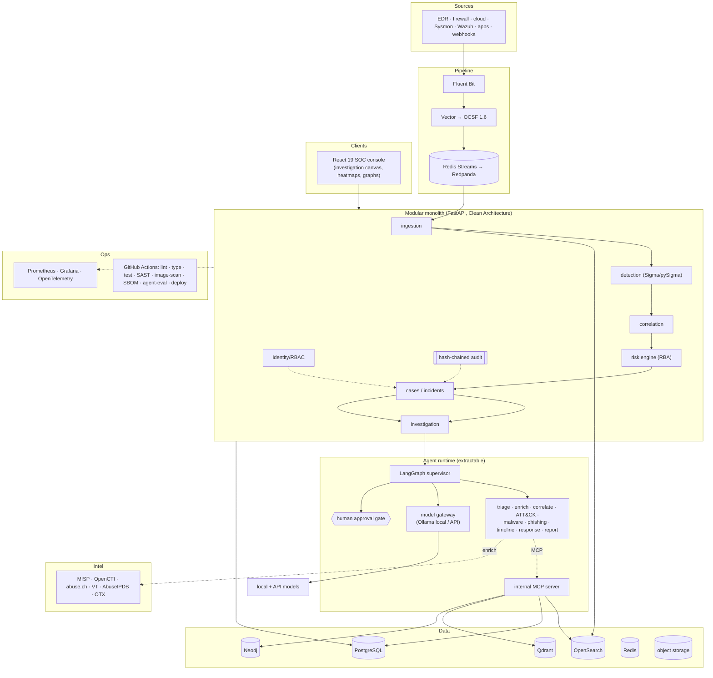

# 12 · Risks, Trade-offs, Improvements & Final Architecture

*Phase 1 · Sentinel-X · covers requested deliverables 17, 19, 20*

---

## Part A — Risks & Trade-offs

### A.1 Architectural trade-offs (chosen path vs. what we gave up)

| Decision | We gained | We accepted | Mitigation |
|----------|-----------|-------------|------------|
| **Modular monolith** over microservices | Simpler ops, laptop-demoable, faster dev, transactional integrity | Less independent scaling on day one; a discipline burden to keep boundaries clean | `import-linter` CI gate; pre-drawn extraction seams ([§03](03-system-architecture.md) §7) |
| **Polyglot persistence** (6 stores) | Right tool per workload; strong portfolio breadth | High operational surface; more to learn/run | `lite` profile collapses footprint; graceful degradation when optional stores absent |
| **OCSF at ingest** | Source-portable detection & AI | Normalisation cost; parser maintenance; OCSF verbosity | Store trimmed field set; Vector VRL does heavy lifting; ship common mappers |
| **Correlation in an owned engine** | Full control, temporal logic Sigma backends can't express | We maintain it | Keep scope narrow (documented patterns); unit-tested rule set |
| **LangGraph durable agents** | Resumable, auditable, HITL-native | Framework lock-in; version churn risk (1.0 is recent) | Thin adapter around LangGraph; agents defined declaratively; 1.0 no-breaking-changes pledge |
| **Local-first models (Ollama)** | No per-token cost, data stays on-prem | Small models weaker at multi-step reasoning | Model gateway routes hard reasoning to API; structured extraction stays local |
| **RBA as primary alerting** | Attacks alert fatigue at the source | Tuning risk weights is non-trivial; risk of under-alerting | Golden-set validation; per-rule weight config; analyst override |
| **Self-hosted / open-source stack** | Predictable economics, no vendor lock-in | We own upgrades, scaling, security patching | CI dependency/image scanning; documented ops runbooks |

### A.2 Delivery & technical risks

| Risk | Likelihood | Impact | Mitigation |
|------|-----------|--------|------------|
| **Scope overrun** (12 phases, solo) | High | High | Strict vertical-slice phasing; each phase independently demoable; Phase 4+ features explicitly deferred |
| **AI produces plausible-but-wrong verdicts** (Gartner's #1 caution) | High | High | Determinism-first, human gates, groundedness checks, golden-set eval gate, analyst override — the core design answer |
| **Prompt injection via tool/enrichment/file content** | Med | High | Untrusted-by-default, curated tool descriptions, output-as-data, egress allowlist ([§07](07-security-architecture.md) §9) |
| **Free-tier intel exhaustion** (VT 500/day) | High | Med | Cache-first, escalate-only enrichment; bulk feeds for the hammered sources |
| **OpenSearch/PG cost & ops at volume** | Med | Med | Hot/warm/cold tiers + searchable snapshots; partitioning; `lite` profile for demos |
| **Version drift** (LangChain<1.0, python-jose, Tailwind v3, ATT&CK pre-v18, anon abuse.ch) | Med | Med | Pinned, verified versions; this analysis flags every trap; Dependabot |
| **LLM cost blowout in investigations** | Med | Med | Per-org token budgets at the gateway; local routing; caching |
| **Malware-sample handling incident** | Low | High | Isolated hardened worker, no in-process execution, external sandbox only ([§07](07-security-architecture.md) §5) |
| **Neo4j/GraphRAG complexity not worth it** | Med | Low | GraphRAG scoped to genuine multi-hop; Postgres-CTE fallback in `lite` |
| **"Portfolio project" perceived as toy** | Med | Med | Production patterns, tests, CI, real detections, honest scope, verified research — this whole doc set is the counter-evidence |

### A.3 Explicit non-goals (managing expectations)

Not fully autonomous; not an EDR/sensor vendor; not planet-scale multi-tenant SaaS on day one; not a
full CNAPP. Each is a deliberate scope boundary, defended in [§01](01-market-gap-competitor-analysis.md)
Part B.

---

## Part B — Suggested Improvements (deliverable 19)

Where the analysis improved on the original brief. Each is an *engineering-judgment* upgrade, with
the reasoning.

1. **Make OCSF normalisation + the data pipeline first-class.** *Every* research strand concluded
   *data quality, not model quality, is the binding constraint.* Elevating ingestion/normalisation
   (Vector → OCSF) from a checkbox to a core module is the highest-leverage change.

2. **Add a Risk-Based Alerting engine as the primary alerting model; demote per-alert
   Notifications.** The #1 documented SOC pain is alert fatigue (63% of alerts unaddressed, 46% false
   positive). Alerting on *accumulated entity risk* rather than per-signal is the structural fix
   every serious platform converged on (Splunk RBA, SentinelOne Storyline, XSIAM stitching).

3. **Consolidate "AI Investigation Engine" + "Multi-Agent AI" into one auditable subsystem with an
   explicit supervisor.** Two overlapping modules become one coherent contract with a single
   decision point — which is also what makes the AI *auditable*, the market's key whitespace.

4. **Introduce a Model Gateway.** Bring-your-own-model, cost control, PII redaction, and
   prompt-injection guarding belong in one abstraction — not scattered per-agent. This is also the
   answer to the SCU/credit pricing backlash.

5. **Adopt detection-as-code with a draft→test→promote workflow.** Readable, versioned,
   MITRE-mapped Sigma rules (Elastic/Sigma lineage) beat black-box ML detections on the transparency
   buyers reward.

6. **Own the correlation engine.** Because Sigma-correlation backend support is patchy, temporal
   logic must live in-platform — turning a limitation into a deliberate capability.

7. **Recommend a modular monolith over microservices**, with documented extraction seams. Knowing
   *when not to distribute* is senior judgment and keeps the project actually shippable by one
   person.

8. **Bake in evaluation (golden-set + groundedness) as a CI gate.** Gartner's caution that "vendor
   claims outpace evidence" becomes a design feature: no agent/prompt change merges without a
   measured non-regression. This is rare even in commercial products.

9. **Consume, don't produce, endpoint telemetry.** No kernel driver / sensor fleet — sidesteps the
   CrowdStrike-Channel-File-291-class blast radius entirely and keeps scope sane.

10. **Defer Cloud Security/CNAPP and DevOps/DAST to Phase 4+.** Honest scoping so the core platform
    is finishable; both re-enter as connectors/sources later.

11. **Two deployment profiles (`lite`/`prod`) with graceful degradation.** A security platform that
    *runs on a laptop for a demo* and *scales in a cluster* is far more useful (and interviewable)
    than one that only does one.

---

## Part C — Final Recommended Architecture (deliverable 20)

The one-screen summary of everything above.

**In one paragraph:** telemetry is normalised to OCSF by a Vector pipeline and streamed over a bus
into a modular-monolith FastAPI core, where deterministic Sigma-based detection and an owned
correlation engine feed a **Risk-Based Alerting** engine that opens incidents only when accumulated
entity risk crosses a threshold. Each incident is investigated by a **LangGraph supervisor** driving
specialist agents (triage, enrichment, ATT&CK mapping, malware/phishing analysis, timeline, response,
reporting) over an **MCP tool layer** and a **model gateway** that keeps data local by default and
guards against prompt injection — with **mandatory human approval gates** on any consequential action
and a **tamper-evident, evidence-linked audit trail** of every decision. Purpose-built stores
(PostgreSQL, OpenSearch, Qdrant, Neo4j, Redis) each own their workload; a `lite` profile runs the
whole thing on a laptop while `prod` scales it on Kubernetes. Detection is deterministic, the LLM is
confined to enrichment/summarisation/ranking, and evaluation is a CI gate — which is exactly what
separates a credible security platform from an impressive demo.

**Recommendation: proceed to Phase 2 (module-by-module implementation) on this architecture.**
